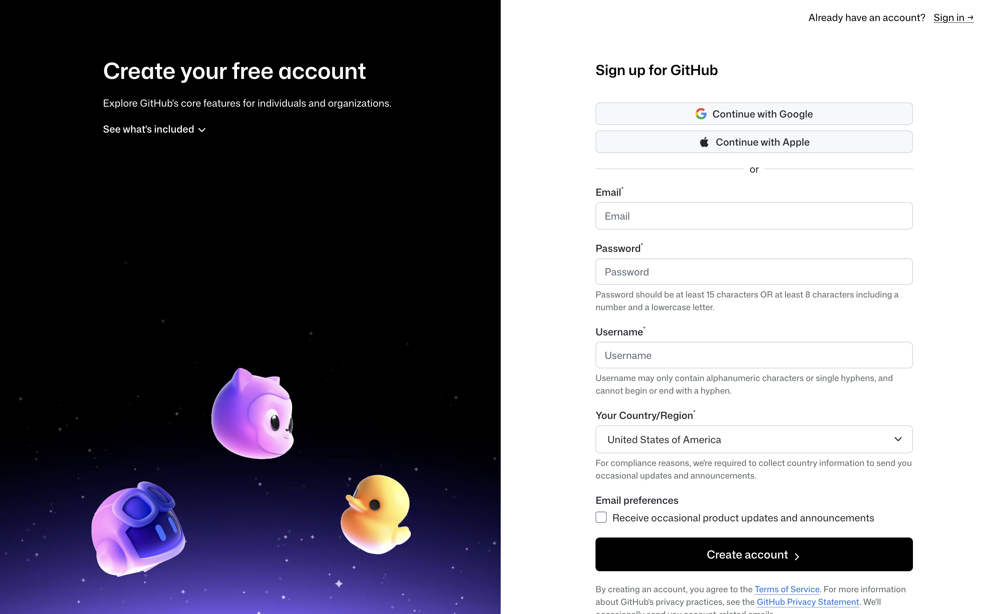

# Alumiboti Organization Access

For most software projects, multiple teams and people need to have access to the contents, either to help develop in unison or to utilize the software themselves.

To enable our team to effectively write the Robot code together, we collaborate using the tools `git` - a local command line program - and [GitHub](https://github.com/) - a cloud service for storing our code.

### Git Overview

### GitHub Overview

#### Alumiboti GitHub Organization

The team manages [the Alumiboti 5590 (`alumiboti5590`) organization](https://github.com/alumiboti5590) on GitHub to manage our team's repositories for robots, shared libraries, and anything else that might be relevant.

The organization enables a free Team plan as we are opted into the [GitHub for Nonprofits](https://github.com/solutions/industry/nonprofits) initiative. This should allow us to add as many members as needed without worry.



If you do not already have a personal GitHub account, please sign up for one at [https://github.com/signup](https://github.com/signup). **You can have one GitHub account for all of your different usages, robotics-related or not**, so there's no need to make it (or the associated name) robotics-specific; first initial and last name are usually a good starting username.

<figure><figcaption>
The signup page for GitHub (as of early 2026)
</figcaption></figure>

Once you have an account, **ask one of the team coaches or programming mentors to invite you to the team organization.**

Once invited, you should receive an email to the address associated with your GitHub account, or you can visit [https://github.com/orgs/alumiboti5590/invitation](https://github.com/orgs/alumiboti5590/invitation) directly, which will present you with a confirmation page.

Click accept, and welcome!

<figure><figcaption>
Accept the invitation to join the organization to complete the process
</figcaption></figure>


Once added to the organization, you will need your Approving Mentor to add you to the relevant GitHub groups for your role(s) on the team, or else **you won't be able to actually see or contribute anything!**





This is for someone who is already an administrator of the `alumiboti5590` GitHub organization and is trying to add a new member.


Before adding new members to the GitHub organization, they must already have a valid GitHub account, which they can sign up for at at [https://github.com/signup](https://github.com/signup). **They can have one GitHub account for all of your different usages, robotics-related or not**, so there's no need to make it (or the associated name) robotics-specific; first initial and last name are usually a good starting username.

**Inviting the GitHub User**

Visit [the _Pending Invitations_ page](https://github.com/orgs/alumiboti5590/people/pending_invitations) of the Alumiboti 5590 organization and select the "Invite Member" button in the top right - as of early 2026.

<figure><figcaption>
The "Invite member" button in the top-right corner
</figcaption></figure>

Input the new member's username (easiest) or email address and confirm the dialog box to initiate the invite process.

<figure><figcaption>
Member selection dialog popup
</figcaption></figure>

Once submitted, they should receive an email at the address associated with their GitHub address, or they can visit [https://github.com/orgs/alumiboti5590/invitation](https://github.com/orgs/alumiboti5590/invitation) directly to accept the invitation.

Make sure to add the user to the appropriate groups below, or else they will be unable to contribute to our repositories!

**Adding the User to Appropriate Groups**

We manage repository write access and permissions via [GitHub Teams](https://github.com/orgs/alumiboti5590/teams). At this time, we only have two groups; a [Mentors](https://github.com/orgs/alumiboti5590/teams/mentors) group and a [Students](https://github.com/orgs/alumiboti5590/teams/students) group. Based on the member being added, select the appropriate group to go into the details and select the "Add a member" button, and fill out the form with the associated member's username.

<figure><figcaption>
Student team page example, with the "Add" button in the top-right corner
</figcaption></figure>


